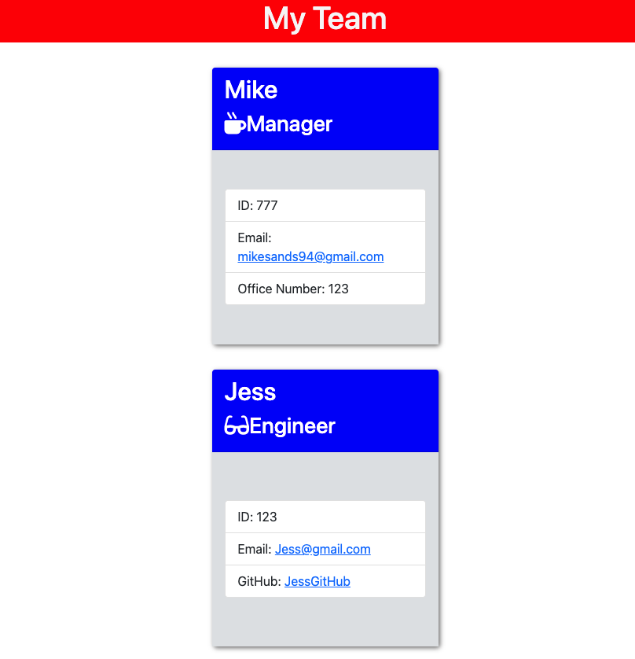

# teamprofileGenerator
Week 06 UCF Coding bootcamp, Node.js and Jest
## Project Decscription
In this project, I used node.js to create a command line application to dynamically generate a staff-team profile and jest to test certain JS functions and classes. Bootstrap was also used for layout / card formatting. 
## Project Location
Repo Link: https://github.com/Msands21/teamprofileGenerator

Screencastify link: https://drive.google.com/file/d/1L9ng1xYrRmn3tP70OEz3CHhzOoF1sWyE/view

### Contact Info
mikesands94@gmail.com

#### Project Example
